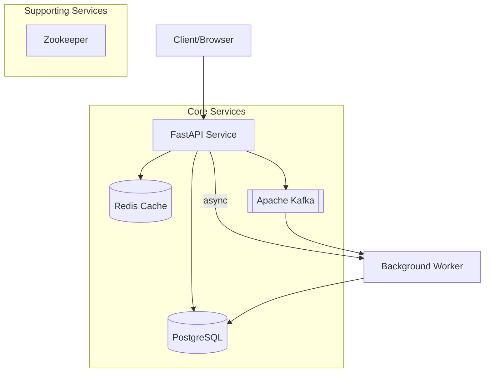

# Banking API Rapid Prototype

A scalable, event-driven banking API built with FastAPI, PostgreSQL, Redis, and Kafka for handling core banking operations with concurrency control and transaction processing.

# Prototype Architecture Diagram


## 🌟 Features

- **Account Management**: Create accounts and query balances
- **Transaction Processing**: Handle credit and debit operations
- **Concurrency Control**: Redis-based locking mechanisms
- **Event Streaming**: Kafka integration for transaction events
- **Horizontal Scaling**: Multiple API instances with load balancing
- **Data Persistence**: PostgreSQL with read replicas

## 🏗️ Architecture

The system follows a microservices architecture with the following components:

### Core Services
- **FastAPI Service**: RESTful API handling banking operations
- **PostgreSQL**: Primary data storage with ACID transactions
- **Redis**: Provides locking mechanism for concurrency control
- **Kafka**: Event streaming for transaction processing
- **Background Worker**: Asynchronous transaction processing

### API Endpoints

```
POST /accounts             # Create a new account
GET  /accounts/{id}/balance # Get account balance
POST /transactions/credit  # Credit an account
POST /transactions/debit   # Debit an account
```

## 🚀 Getting Started

### Prerequisites

- Docker and Docker Compose

### Running Locally

1. Clone the repository
```bash
git clone https://github.com/username/banking-api.git
cd banking-api
```

2. Start the services
```bash
docker-compose up -d
```

3. Access the API documentation
```
http://localhost:8000/docs
```

## 📁 Project Structure

```
banking-api/
├── app/
│   ├── main.py                  # FastAPI entry point
│   ├── database.py              # DB connection & models
│   ├── schemas.py               # Pydantic models
│   ├── routes/
│   │   ├── accounts.py          # Account endpoints
│   │   └── transactions.py      # Transaction endpoints
│   ├── services/
│   │   ├── accounts.py          # Account business logic
│   │   └── transactions.py      # Transaction processing
│   └── utils/
│       ├── redis.py             # Redis client
│       └── kafka.py             # Kafka producer/consumer
├── tests/
│   └── test_api.py              # Basic integration tests
├── docker-compose.yml           # Dev environment
└── requirements.txt             # Core dependencies
```

## 🧪 Testing

Run the test suite:

```bash
docker-compose exec api pytest
```

## 📊 Implementation Phases

### Phase 1: Infrastructure Setup
- Local development environment via Docker
- Basic database schema
- Essential services configuration

### Phase 2: Basic API Implementation
- Account creation with initial balance
- Balance inquiry endpoint
- Basic credit/debit transactions

### Phase 3: Core Business Logic
- Redis-based locking for concurrency control
- Balance validation logic
- Atomic database operations

### Phase 4: Event Streaming Basics
- Event production for transactions
- Basic consumer scaffolding
- Event schema standardization

### Phase 5: Testing & Validation
- Unit tests for service layer
- Integration tests for API endpoints
- E2E tests for transaction flows

## 🔄 Deployment Flow

```
Local Development → Staging → Production
```

Production environment includes:
- Load balancing
- Database replication
- Horizontal API scaling
- Basic monitoring

## 📝 API Examples

### Create Account
```bash
curl -X POST http://localhost:8000/accounts
```

Response:
```json
{
  "id": "550e8400-e29b-41d4-a716-446655440000"
}
```

### Credit Account
```bash
curl -X POST http://localhost:8000/transactions/credit \
  -H "Content-Type: application/json" \
  -d '{"account_id": "550e8400-e29b-41d4-a716-446655440000", "amount": 100.00}'
```

Response:
```json
{
  "status": "success"
}
```

## 🛠️ Key Simplifications

This rapid prototype focuses on demonstrating core banking capabilities while maintaining flexibility for future enhancements:

1. Single PostgreSQL instance vs sharded cluster
2. Simplified Redis locking vs distributed locks
3. Minimal Kafka topics (2 vs 6+ in full plan)
4. No advanced monitoring (Prometheus/Grafana)
5. Basic authentication vs full JWT/OAuth
6. Simple error handling vs dead letter queues

## 📄 License

[MIT](LICENSE)